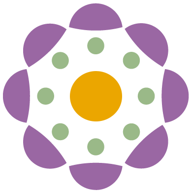

# Nightshade for Canvas
A browser extension for Firefox and Chrome that transforms the Canvas LMS with a modern, responsive UI and dark mode.

[Chrome Web Store page](https://chromewebstore.google.com/detail/nightshade-for-canvas/elbmejcmanonhlblofclgchmgdeiibpn) (currently an old version of the extension)

## Docs quick links
- [Project setup](docs/setup.md)
- [To-do](docs/todo.md)
- [Extensions](docs/extensions.md)
- [JavaScript](docs/js.md)
- [CSS](docs/css.md)
